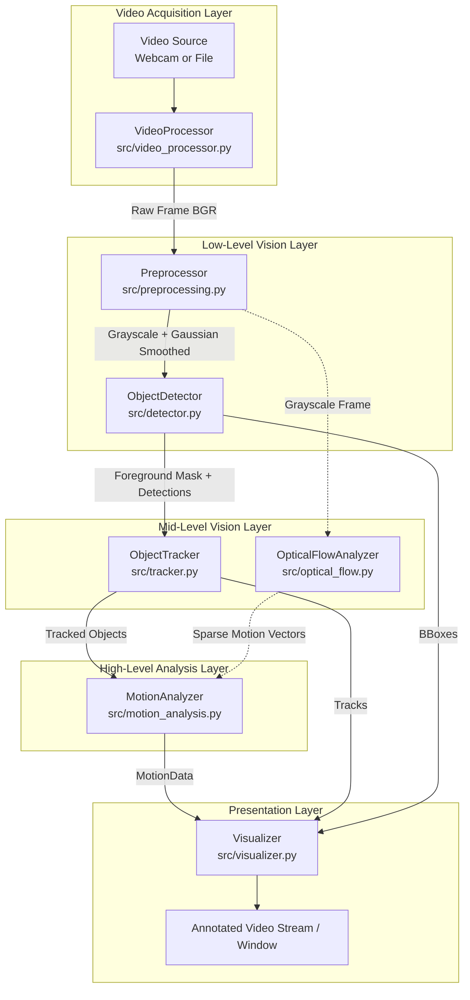

# System Architecture: CV-MotionTrack

## 1. Architectural Overview

**CV-MotionTrack** is structured around a sequential, unidirectional data-flow pipeline. The design follows the principle of **Separation of Concerns (SoC)** and **Loose Coupling**: each processing phase is encapsulated within an isolated Python class that operates on standardized, strongly-typed data structures (`dataclasses`).

No processing module directly depends on the concrete implementation of upstream or downstream modules. Instead, communication occurs via standard NumPy array tensors (`np.ndarray`) and lightweight domain dataclasses (`Detection`, `TrackedObject`, `MotionData`).

---

## 2. Component Descriptions

### 2.1 Video Processor (`src/video_processor.py`)
- **Role**: Hardware abstraction and stream acquisition.
- **Inputs**: Device index (`int`) or filesystem path (`str`).
- **Outputs**: Tuple `(ret: bool, frame: Optional[np.ndarray])`.
- **Key Responsibilities**:
  - Validates source availability and device access permissions.
  - Queries stream properties (width, height, FPS, frame count).
  - Handles stream termination, frame drops, and graceful resource release.

### 2.2 Preprocessor (`src/preprocessing.py`)
- **Role**: Spatial intensity conditioning and high-frequency noise mitigation.
- **Inputs**: Raw image frame `(H, W, 3)`.
- **Outputs**: Preprocessed single-channel image `(H, W)` uint8.
- **Key Responsibilities**:
  - Color-space transformation from 3-channel BGR to 1-channel luminance/grayscale.
  - 2D Gaussian kernel convolution to attenuate sensor noise.
  - Input validation on tensor dimensions and positive odd kernel sizes.

### 2.3 Object Detector (`src/detector.py`)
- **Role**: Segmentation of candidate foreground moving entities.
- **Inputs**: Preprocessed frame `(H, W)`.
- **Outputs**: `Tuple[List[Detection], np.ndarray]` (bounding boxes and binary mask).
- **Key Responsibilities**:
  - Statistical pixel modeling across temporal history (MOG2 / KNN).
  - Foreground mask extraction and shadow thresholding.
  - Morphological noise cleaning (Opening to remove spackle, Closing to fill holes).
  - Contour analysis, spatial moments for centroid calculation, and area thresholding.

### 2.4 Object Tracker (`src/tracker.py`)
- **Role**: Temporal state persistence and identity management.
- **Inputs**: `List[Detection]`.
- **Outputs**: `List[TrackedObject]`.
- **Key Responsibilities**:
  - Assigns unique sequential object IDs.
  - Computes pairwise Euclidean centroid distance matrix between existing tracks and new detections.
  - Matches identities while handling newly appearing objects and disappearing objects.
  - Maintains chronological trajectory coordinate history for path visualization.

### 2.5 Optical Flow Analyzer (`src/optical_flow.py`)
- **Role**: Apparent motion field estimation.
- **Inputs**: Consecutive preprocessed grayscale frames.
- **Outputs**: Paired feature vectors `(good_old, good_new, status)`.
- **Key Responsibilities**:
  - Extracts trackable corners using the Shi-Tomasi criterion (`goodFeaturesToTrack`).
  - Tracks sparse feature points using iterative Lucas-Kanade differential optical flow.

### 2.6 Motion Analyzer (`src/motion_analysis.py`)
- **Role**: Quantitative kinematic parameter extraction.
- **Inputs**: `List[TrackedObject]`.
- **Outputs**: `Dict[int, MotionData]`.
- **Key Responsibilities**:
  - Calculates inter-frame Euclidean displacement $\Delta d$.
  - Estimates angular heading direction $\theta \in [0^\circ, 360^\circ)$.
  - Calculates approximate real-time velocity $v = \Delta d / \Delta t$ in pixels per second.
  - Maintains lifetime motion history and global statistical aggregations.

### 2.7 Visualizer (`src/visualizer.py`)
- **Role**: Diagnostic rendering and analytical HUD presentation.
- **Inputs**: Frame image, detections, tracked objects, motion metrics, and system stats.
- **Outputs**: Fully annotated composite BGR image tensor.
- **Key Responsibilities**:
  - Renders color-coded bounding boxes and centroid markers.
  - Draws multi-segment trajectory polylines.
  - Draws directional motion vectors with proportional arrowheads.
  - Overlays a semi-transparent HUD banner with FPS and tracking statistics.

### 2.8 Centralized Configuration (`src/config.py`)
- **Role**: Hyperparameter encapsulation.
- **Key Responsibilities**:
  - Groups parameters by subsystem (`VideoConfig`, `PreprocessingConfig`, `DetectorConfig`, `TrackerConfig`, `OpticalFlowConfig`, `MotionAnalysisConfig`, `VisualizationConfig`).
  - Eliminates hardcoded magic numbers across the codebase.

---

## 3. Inter-Module Data Contracts

The system uses standard dataclasses defined in [`src/data_models.py`](file:///c:/Users/Shiva%20Raghuwanshi/Documents/Computer_vision_project/src/data_models.py):

| Dataclass | Key Fields | Purpose |
|---|---|---|
| `BoundingBox` | `x, y, width, height` | Enclosing spatial coordinates of a candidate blob. |
| `Detection` | `bbox: BoundingBox, centroid: (x, y), confidence, area` | Output of detector passed to tracker. |
| `TrackedObject` | `object_id, current_position, previous_position, trajectory, bbox, disappeared_count` | Output of tracker representing continuous object state. |
| `MotionData` | `object_id, displacement, direction, approximate_velocity, instantaneous_speed` | Output of motion analyzer containing kinematic parameters. |
