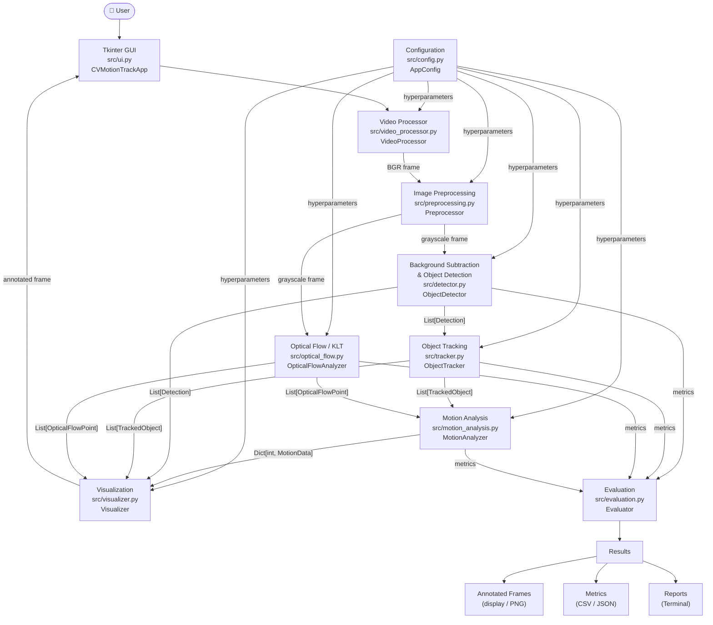
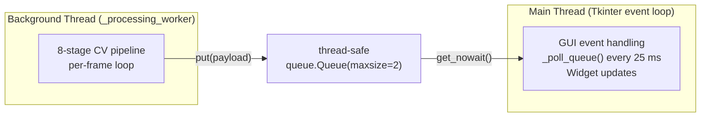

# System Architecture — CV-MotionTrack

**Academic Coursework: CSE3010 Computer Vision**

This document describes the modular layered architecture of the CV-MotionTrack system.
Every module corresponds directly to a Python source file in `src/`.

---

## Pipeline Overview

---

## Component Descriptions

### 1. Tkinter GUI (`src/ui.py` — `CVMotionTrackApp`)
The presentation and coordination layer. Runs the 8-stage CV pipeline in an isolated
background thread and forwards annotated frames to the GUI via a thread-safe `queue.Queue`.
Provides interactive controls (Start, Pause, Resume, Reset, Save Frame, Stop), real-time
telemetry labels (FPS, detections, flow points), a live kinematics table for tracked objects,
and adjustable hyperparameter sliders that propagate changes to the active CV modules.

### 2. Video Processor (`src/video_processor.py` — `VideoProcessor`)
Wraps OpenCV `VideoCapture` to acquire frames from a webcam device index or a video file
path. Validates stream availability, optionally enforces a target resolution, and exposes
`read_frame()` for sequential frame retrieval. Implements the Python context-manager protocol
for safe resource release. Supports both live capture (device index `0`) and file playback.

### 3. Image Preprocessing (`src/preprocessing.py` — `Preprocessor`)
Converts incoming BGR video frames to single-channel grayscale using `cv2.cvtColor` and
then applies 2D Gaussian spatial filtering (`cv2.GaussianBlur`) to suppress high-frequency
sensor noise. Grayscale conversion reduces computational cost for background modeling and
optical flow; Gaussian smoothing improves the stability of background model pixel statistics.
Kernel size and sigma are configurable via `PreprocessingConfig`.

### 4. Background Subtraction & Detection (`src/detector.py` — `ObjectDetector`)
Maintains an adaptive background model using OpenCV's MOG2 (Gaussian Mixture Model) or KNN
background subtractor. Each frame produces a binary foreground mask; shadow pixels (value 127)
are thresholded out. Morphological Opening removes isolated noise pixels; Closing fills
intra-object holes. Contours are extracted with `cv2.findContours`, filtered by minimum and
maximum area, and converted to `Detection` dataclasses containing bounding boxes and centroids.

### 5. Object Tracking (`src/tracker.py` — `ObjectTracker`)
Implements centroid-based multi-object tracking using greedy Euclidean distance matching.
Each active track is a `TrackedObject` with a unique persistent integer ID, a trajectory
(historical centroid list), and a disappearance counter. New detections within `max_distance`
pixels are matched to existing tracks; unmatched detections spawn new IDs; tracks absent for
more than `max_disappeared` frames are deregistered. Trajectory length is bounded by
`max_trajectory_length` to limit memory.

### 6. Optical Flow / KLT (`src/optical_flow.py` — `OpticalFlowAnalyzer`)
Selects trackable corner feature points using the Shi-Tomasi detector (`cv2.goodFeaturesToTrack`).
Tracks these points frame-to-frame using the pyramidal Lucas-Kanade algorithm
(`cv2.calcOpticalFlowPyrLK`), which solves the Lucas-Kanade least-squares system within a
sliding spatial window at multiple Gaussian pyramid scales. Valid tracked points are returned
as `OpticalFlowPoint` dataclasses with `(dx, dy)` motion vectors. Features are automatically
reinitialized when the tracked count falls below `min_features`.

### 7. Motion Analysis (`src/motion_analysis.py` — `MotionAnalyzer`)
Converts tracked centroid positions and optical flow points into kinematic parameters per
tracked object: frame-to-frame displacement `d = sqrt(dx² + dy²)`, 8-sector image-space
direction (RIGHT, DOWN-RIGHT, DOWN, DOWN-LEFT, LEFT, UP-LEFT, UP, UP-RIGHT), heading angle
`θ = atan2(dy, dx)`, pixel-per-frame velocity, pixel-per-second approximate velocity
(using measured FPS), cumulative path length, and net displacement. A sliding moving-average
window smooths noisy raw centroid measurements. Reports are presented as `MotionData` dataclasses.

### 8. Visualization (`src/visualizer.py` — `Visualizer`)
Renders all CV annotations onto a copy of the original BGR frame using OpenCV drawing
primitives: green bounding rectangles, red centroid dots, yellow trajectory polylines,
cyan optical flow vector arrows, per-object motion info badges (direction, displacement,
velocity), and a telemetry HUD panel showing FPS, detection count, active track count,
flow points, and moving/stationary object counts. All visual elements are configurable
via `VisualizationConfig`.

### 9. Evaluation (`src/evaluation.py` — `Evaluator`)
Profiles system-level performance per frame using `time.perf_counter`: processing latency,
FPS, detection counts, track lifetimes, optical flow point counts, and motion kinematics.
Aggregates per-frame `FrameMetrics` into an `EvaluationSummary` across an entire video.
Exports results to machine-readable CSV and JSON formats in `results/metrics/`.
Does **not** claim precision/recall accuracy without annotated ground-truth datasets.

### 10. Configuration (`src/config.py` — `AppConfig`)
Provides a hierarchy of immutable dataclass configuration objects (`VideoConfig`,
`PreprocessingConfig`, `DetectorConfig`, `TrackerConfig`, `OpticalFlowConfig`,
`MotionAnalysisConfig`, `VisualizationConfig`, `OutputConfig`) that are composed into
`AppConfig`. Eliminates hard-coded magic numbers; all hyperparameters are centrally
documented with their units and default values.

---

## Threading Model

The GUI thread **never** executes CV code. The worker thread **never** touches Tkinter widgets.
Communication is purely through the queue, preventing UI freezing under heavy processing load.

---

## Data Flow Contracts

| Boundary | Type | Description |
|---|---|---|
| VideoProcessor → Preprocessor | `np.ndarray` (BGR H×W×3) | Raw video frame |
| Preprocessor → Detector | `np.ndarray` (gray H×W) | Noise-reduced grayscale frame |
| Preprocessor → OpticalFlow | `np.ndarray` (gray H×W) | Same grayscale frame |
| Detector → Tracker | `List[Detection]` | Foreground object candidates |
| Tracker → MotionAnalyzer | `List[TrackedObject]` | Persistent tracked entities |
| OpticalFlow → MotionAnalyzer | `List[OpticalFlowPoint]` | Sparse motion vectors |
| MotionAnalyzer → Visualizer | `Dict[int, MotionData]` | Per-object kinematics |
| Visualizer → UI | `np.ndarray` (BGR H×W×3) | Annotated composite frame |
