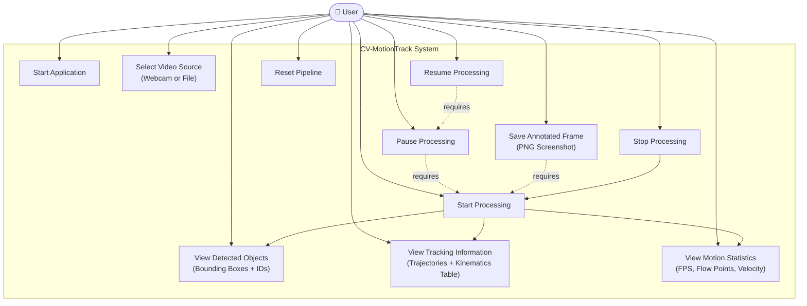
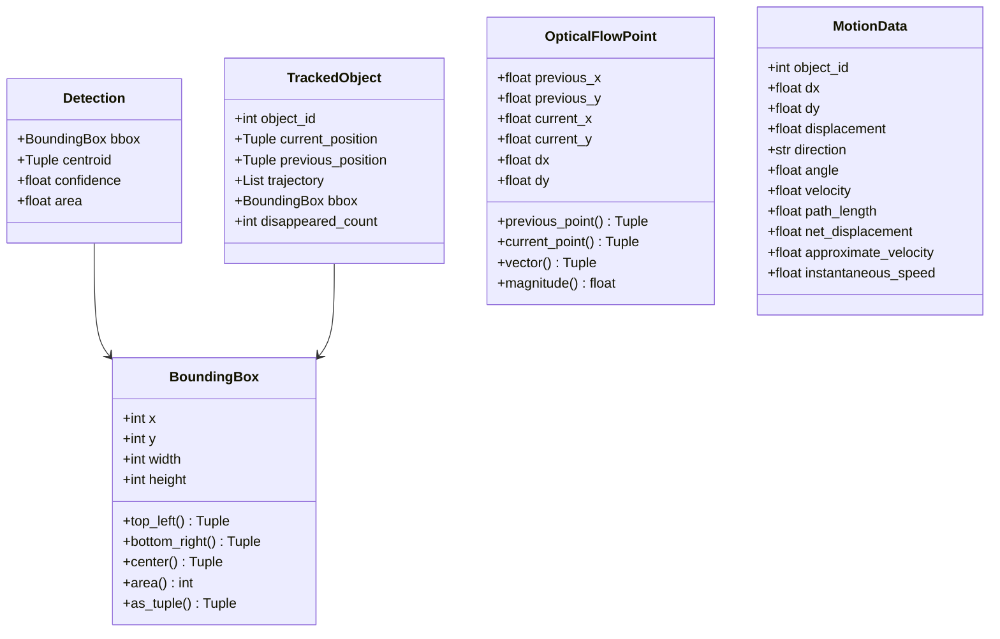
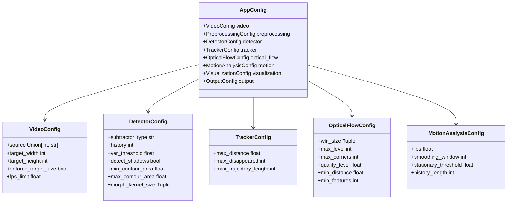
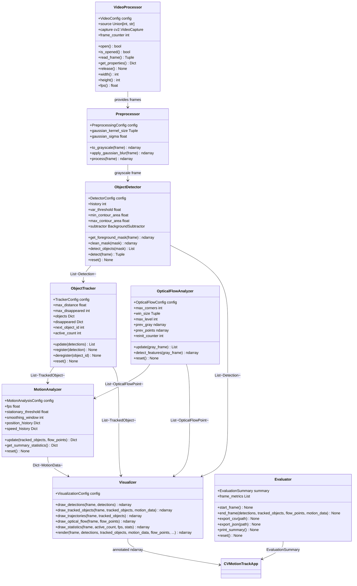
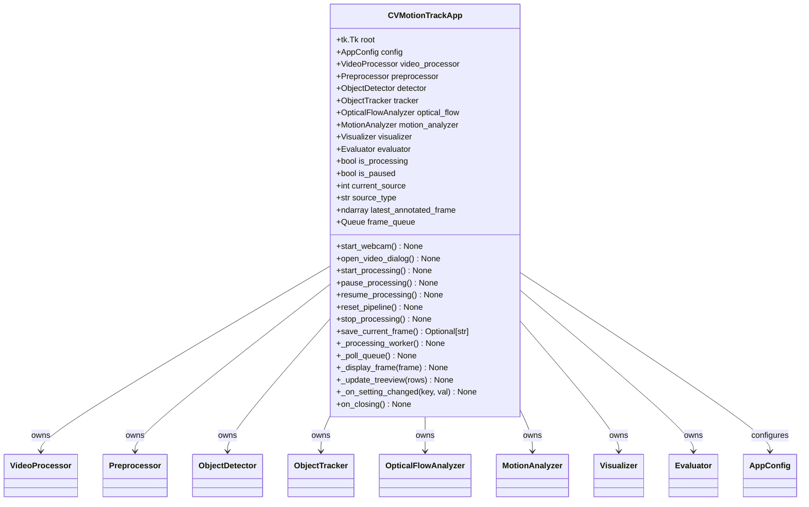
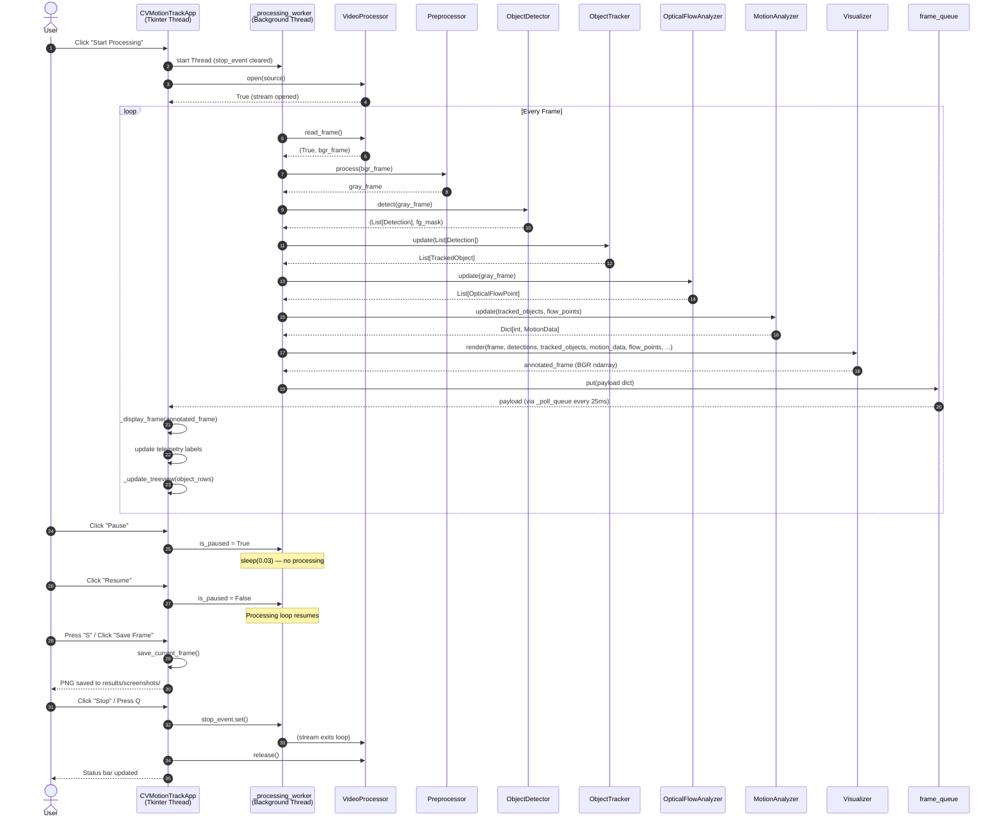

# UML Diagrams — CV-MotionTrack

**Academic Coursework: CSE3010 Computer Vision**

This document contains three UML diagrams for the CV-MotionTrack system:
1. Use Case Diagram — system interactions from the user's perspective
2. Class Diagram — the actual Python class structure and relationships
3. Sequence Diagram — the runtime processing loop interaction between components

All diagrams reflect the **actual** implementation. No speculative features are included.

---

## A. Use Case Diagram

The single external actor is the **User**, who interacts with the system through the Tkinter
graphical user interface. The processing pipeline and its CV modules are internal actors.

---

## B. Class Diagram

The class diagram shows the actual Python classes, their key attributes and methods, and
their relationships. Only attributes and methods that exist in the source code are shown.

### Data Models (`src/data_models.py`)

### Configuration (`src/config.py`)

### Processing Modules

### UI Controller

---

## C. Sequence Diagram

The sequence diagram shows the runtime interaction between components for a single
processed frame. The processing loop runs in a background thread (`_processing_worker`)
to keep the Tkinter UI responsive.

---

## Design Patterns Observed

| Pattern | Where Used |
|---|---|
| **Strategy** | `ObjectDetector` accepts `subtractor_type` ("MOG2"/"KNN") at construction |
| **Observer (polling)** | `_poll_queue` + `frame_queue` decouples worker thread from GUI thread |
| **Facade** | `CVMotionTrackApp` coordinates 8 CV modules behind a single interface |
| **Data Transfer Object** | `Detection`, `TrackedObject`, `MotionData`, `OpticalFlowPoint` dataclasses |
| **Configuration Object** | `AppConfig` aggregates all subsystem configs centrally |
| **Context Manager** | `VideoProcessor` implements `__enter__`/`__exit__` for resource safety |
