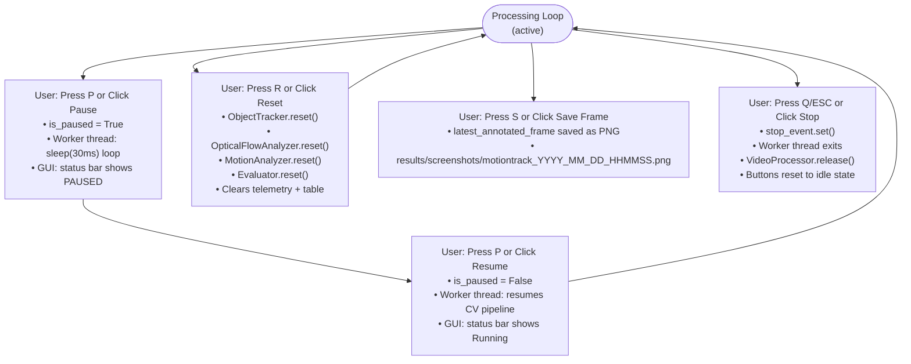
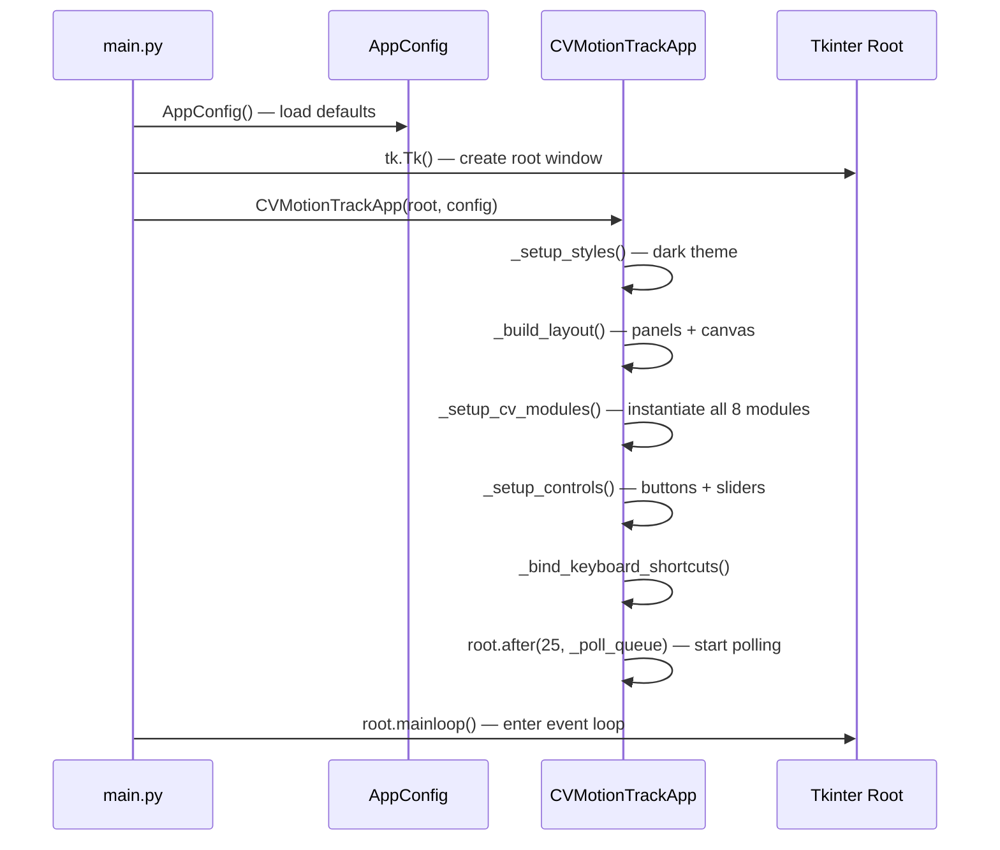

# Runtime Workflow — CV-MotionTrack

**Academic Coursework: CSE3010 Computer Vision**

This document describes the complete runtime workflow of the CV-MotionTrack system,
from application launch to shutdown. The workflow covers both the nominal processing
path and all user interaction branches.

---

## Complete Runtime Flowchart

```mermaid
flowchart TD
    START(["▶ Start Application\npython main.py"])
    INIT["Initialize Application\n• Load AppConfig\n• Construct CV modules\n• Build Tkinter GUI\n• Start _poll_queue loop"]
    SELECT["Select Video Source\n• Webcam (Device 0)\n• or Open Video File"]
    START_BTN["Click 'Start Processing'\n• Open VideoProcessor\n• Launch background worker thread"]
    READ["Read Frame\nVideoProcessor.read_frame()"]
    VALIDATE{"Frame\nvalid?"}
    STOP_STREAM(["Stream ended / error\n→ Stop Processing"])
    PRE["Preprocess Frame\n• cvtColor BGR→Gray\n• GaussianBlur(5×5)"]
    BG["Apply Background Subtraction\n• MOG2/KNN model update\n• Foreground mask extraction"]
    MORPH["Clean Foreground Mask\n• Threshold shadow pixels (127)\n• Morphological Opening (noise removal)\n• Morphological Closing (gap fill)"]
    DETECT["Detect Moving Objects\n• findContours on clean mask\n• Filter by area (min/max)\n• Extract BoundingBox + centroid\n→ List[Detection]"]
    TRACK["Track Objects\n• Compute pairwise Euclidean distances\n• Greedy nearest-centroid matching\n• Assign/maintain object IDs\n• Update trajectories\n→ List[TrackedObject]"]
    FLOW["Optical Flow / KLT\n• Shi-Tomasi feature detection\n• Pyramidal Lucas-Kanade tracking\n• Filter by status mask\n→ List[OpticalFlowPoint]"]
    MOTION["Calculate Motion Parameters\n• dx, dy displacement\n• Euclidean distance d = √(dx²+dy²)\n• Direction (8 sectors)\n• Angle θ = atan2(dy, dx)\n• Velocity v = d / Δt (px/frame, px/s)\n• Path length, net displacement\n→ Dict[int, MotionData]"]
    VIS["Generate Visualization\n• Bounding boxes\n• Object IDs\n• Trajectory trails\n• Optical flow vectors\n• Motion info badges\n• HUD telemetry panel\n→ annotated BGR frame"]
    DISPLAY["Display Frame + Statistics\n• GUI canvas update\n• Telemetry labels (FPS, counts)\n• Kinematics table (ID, direction, velocity)"]
    MORE{"More\nFrames?"}
    SAVE_R["Save Results\n• Export metrics CSV/JSON\n• Terminal summary"]
    END(["■ End"])

    START --> INIT --> SELECT --> START_BTN --> READ
    READ --> VALIDATE
    VALIDATE -- "No" --> STOP_STREAM --> SAVE_R --> END
    VALIDATE -- "Yes" --> PRE --> BG --> MORPH --> DETECT --> TRACK --> FLOW --> MOTION --> VIS --> DISPLAY --> MORE
    MORE -- "Yes" --> READ
    MORE -- "No" --> SAVE_R --> END
```



---

## User Interaction Branches

User actions can interrupt the processing loop at any point during active operation.



---

## Per-Frame Processing Detail

Each iteration of the background worker thread processes exactly one frame through the
complete 8-stage pipeline:

| Stage | Module | Input | Output |
|---|---|---|---|
| 1. Acquire | `VideoProcessor` | Video stream | BGR frame `(H×W×3)` |
| 2. Preprocess | `Preprocessor` | BGR frame | Grayscale frame `(H×W)` |
| 3. Background model | `ObjectDetector` | Grayscale frame | Foreground mask |
| 4. Clean mask | `ObjectDetector` | Foreground mask | Binary clean mask |
| 5. Detect | `ObjectDetector` | Clean mask | `List[Detection]` |
| 6. Track | `ObjectTracker` | `List[Detection]` | `List[TrackedObject]` |
| 7. Optical flow | `OpticalFlowAnalyzer` | Grayscale frame | `List[OpticalFlowPoint]` |
| 8. Motion analysis | `MotionAnalyzer` | TrackedObjects + FlowPoints | `Dict[MotionData]` |
| 9. Visualize | `Visualizer` | All above | Annotated BGR frame |

After stage 9, the annotated frame and metric payload are placed onto the thread-safe
`frame_queue`. The Tkinter main thread polls the queue every 25 ms, dequeues the latest
payload, updates the video canvas, and refreshes all telemetry widgets.

---

## Initialization Sequence



---

## Headless / CLI Mode

In addition to the GUI mode, `main.py` supports a `--headless` flag for non-interactive
automated evaluation:

```
python main.py --headless --source <video_path> [--output <output_path>]
```

In headless mode the Tkinter GUI is **not** created. The processing loop runs directly
on the calling thread, writing evaluation metrics to `results/metrics/` and optionally
saving an annotated output video.

---

## Keyboard Shortcuts

| Key | Action |
|---|---|
| `P` | Pause / Resume processing |
| `R` | Reset pipeline |
| `S` | Save current annotated frame |
| `Q` or `ESC` | Stop processing and exit |
