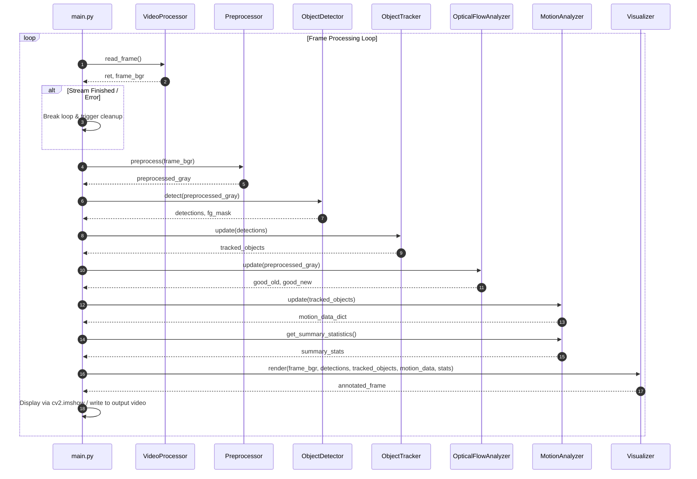
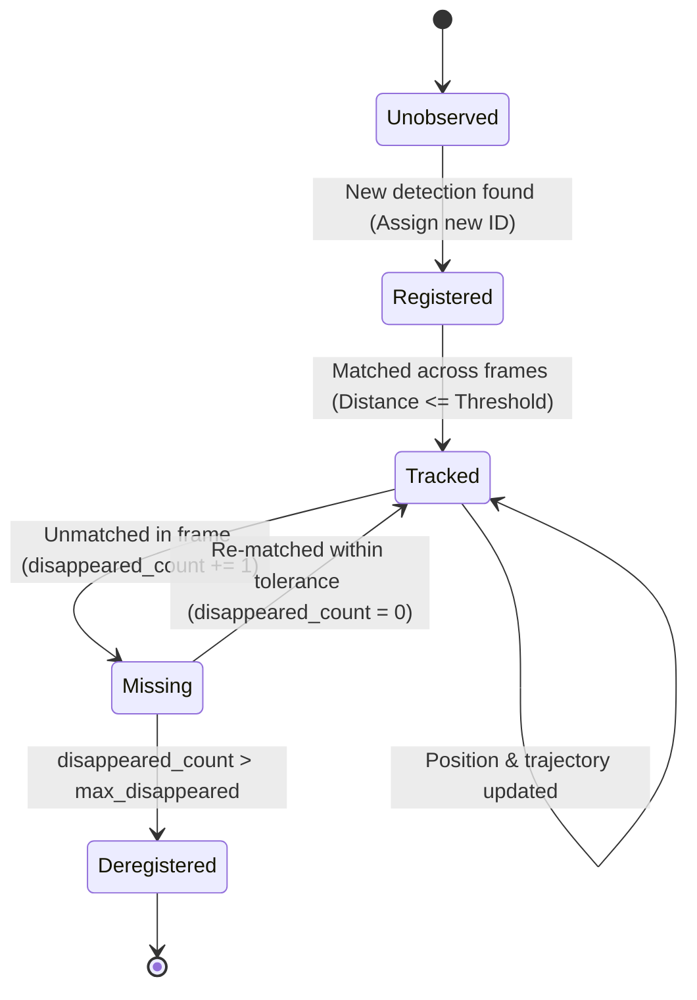

# Processing Workflow: CV-MotionTrack

## 1. Frame-Level Execution Sequence

Every video frame ingested by CV-MotionTrack passes through a deterministic sequence of processing stages orchestrated by `main.py`.

---

## 2. Detailed Step-by-Step Processing

### Step 1: Ingestion & Validation
- The `VideoProcessor` retrieves the current frame from the hardware device or file pointer via OpenCV `read()`.
- Validates that the frame buffer is non-empty and uncorrupted.
- If resizing is enforced in `VideoConfig`, resizes the frame to `(target_width, target_height)`.

### Step 2: Spatial Preprocessing
- Converts 3-channel color image (BGR) into a 1-channel luminance image (Grayscale):
  $$I_{\text{gray}} = 0.299 R + 0.587 G + 0.114 B$$
- Convolves the grayscale image with an isotropic 2D Gaussian kernel of dimensions $(k_w, k_h)$ to attenuate high-frequency sensor noise and camera jitter.

### Step 3: Background Subtraction & Foreground Modeling
- The preprocessed frame is fed into the adaptive background model (MOG2).
- The subtractor updates its internal Gaussian mixture distribution per pixel and generates a ternary mask (0 = Background, 127 = Shadow, 255 = Moving Foreground).
- Thresholding suppresses shadow regions to zero.

### Step 4: Morphological Cleanup & Detection
- **Opening**: Erosion followed by dilation removes isolated false-positive noise pixels.
- **Closing**: Dilation followed by erosion bridges disconnected contours within the same physical entity.
- External contour boundaries are extracted via border-following.
- Contours falling outside $[A_{\min}, A_{\max}]$ are pruned.
- Centroids $(\bar{x}, \bar{y})$ are computed via spatial image moments:
  $$\bar{x} = \frac{M_{10}}{M_{00}}, \quad \bar{y} = \frac{M_{01}}{M_{00}}$$
- Candidate bounding boxes and centroids are packaged as `Detection` instances.

### Step 5: Object Tracking & Identity Association
The `ObjectTracker` updates the state machine of all observed entities:

1. Pairwise Euclidean distances between current track positions and new detections are computed.
2. Tracks are greedily matched to detections below `max_distance_threshold`.
3. Matched tracks update their current position, append to trajectory history, and reset `disappeared_count = 0`.
4. Unmatched existing tracks increment `disappeared_count`. If this exceeds `max_disappeared`, the track is purged.
5. Unmatched detections are registered as new entities with monotonically increasing object IDs.

### Step 6: Optical Flow Field Estimation
- Features (corners) are extracted using the Shi-Tomasi criterion in the previous frame.
- Iterative Lucas-Kanade optical flow calculates displacement vectors to the current frame.
- High-error or out-of-boundary feature tracks are culled via the tracking status vector.

### Step 7: Motion Kinematics Analysis
For each active `TrackedObject`:
- **Displacement**: $\Delta d = \sqrt{(x_t - x_{t-1})^2 + (y_t - y_{t-1})^2}$
- **Direction**: $\theta = \text{atan2}(y_t - y_{t-1}, x_t - x_{t-1}) \times \frac{180}{\pi} \pmod{360}$
- **Velocity**: $v = \frac{\Delta d}{\Delta t} = \Delta d \times \text{FPS}$ (pixels/second)
- Motion data is recorded into the entity's lifetime movement history.

### Step 8: Visualization & Display
- Bounding boxes are drawn with configured line colors and thicknesses.
- Trajectory lines are drawn connecting historical centroid coordinates.
- Directional velocity arrows indicate orientation and speed.
- A semi-transparent diagnostic telemetry dashboard is overlaid at the top of the frame.
- The annotated frame is presented in an interactive OpenCV HighGUI window (or written to an output stream in headless mode).
